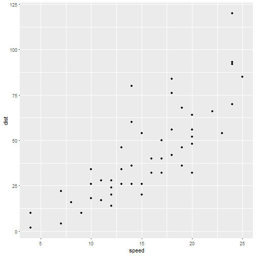

This time we will build the `html` file for any given file name.

The Makefile uses patterns to allow the input of the file name.

```
# this Makefile will work for any notebook by using patterns
%.html : %.Rmd
	Rscript -e 'rmarkdown::render("$<")'
```

From the console run:

```
make generic.html
```


```r
library(ggplot2)

ggplot(cars, aes(x = speed, y = dist)) +
    geom_point()
```



